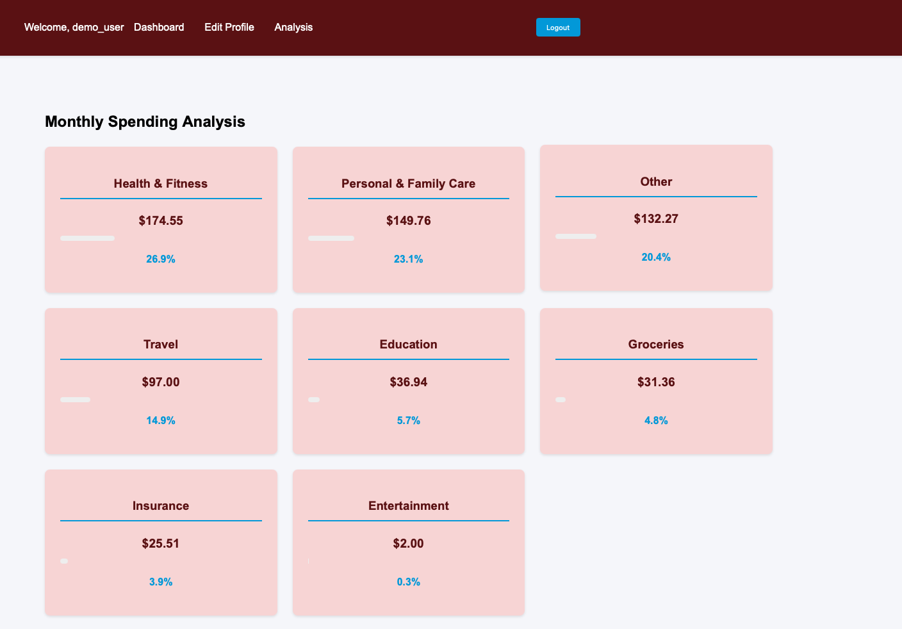
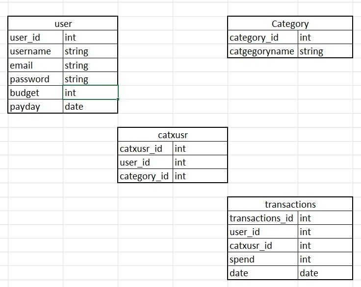

# BudgetBuddy 

BudgetBuddy is a comprehensive web application built with Python, Django, and SQL that empowers users to efficiently manage their monthly budgets, track spending across various categories, and monitor deposits. Leveraging Django’s robust backend framework and SQL for reliable data storage, the app provides a secure and scalable foundation. Its clean, user-friendly interface ensures a seamless experience for users to view, analyze, and interact with their financial data.

## Planning materials: 

[My-Trello](https://trello.com/b/NAEff5JR/budget-planner)

### Link
* [Deploy-link](https://budget-buddy1-c92a3320901e.herokuapp.com/dashboard/)

## Technologies used:

* **Frontend:** 
    -HTML
    -CSS
* **Backend:** 
    -Python     
    -Django
* **Database:** 
    PostgreSQL for storing user data and information.
* **Authentication:** 
    Django built-in authentication system. 

#### The code uses the following libraries: 
* **django.contrib.auth**
* **django.db.models**
* **django.shortcuts**
* **django.forms**
* **django.contrib.admin**
* **pathlib**
* **datetime**
